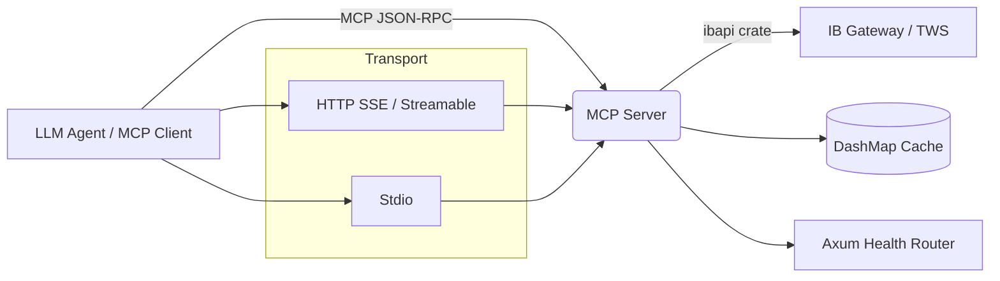

# ibkr-mcp-rs

Interactive Brokers MCP Server in Rust. Exposes market data, account information, positions, and connection status via the [Model Context Protocol (MCP)](https://modelcontextprotocol.io/) so LLM agents can query live brokerage data.

## Features

| Feature | Description |
|---------|-------------|
| **Market Data Quotes** | Real-time or delayed stock quotes with automatic entitlement fallback |
| **Account Info** | Net liquidation, available funds, buying power, daily PnL |
| **Positions** | Current holdings with unrealized / daily PnL |
| **Connection Status** | Live IBKR gateway connectivity check |
| **Order Manager** | Order placement infrastructure (extensible for trading agents) |
| **Dual Transport** | HTTP (SSE/streamable) or stdio for local integrations |
| **Health Checks** | `/health/live`, `/health/ready`, `/health/broker`, `/version` |

## Architecture



## MCP Tools Reference

| Tool | Parameters | Returns |
|------|------------|---------|
| `get_market_data` | `symbol` (string), `data_type` (`"quote"`, `"historical"`, `"option_chain"`), `period`, `expiration` | Quote JSON with bid/ask/last/volume/high/low/close/source |
| `get_account_info` | `account_id` (optional) | Account summary: netLiquidation, availableFunds, buyingPower, dailyPnL |
| `get_positions` | `account_id` (optional) | Array of positions: symbol, quantity, averageCost, marketPrice, marketValue, unrealizedPnL, dailyPnL |
| `get_connection_status` | none | `brokerConnected: true/false` + timestamp |

### Quote Source Fallback

If a real-time market data subscription is not available (IBKR error codes 10089, 10167, 10168, 10169, 354), the server automatically retries with delayed data and caches the result.

## Prerequisites

- Rust **1.75+**
- [IB Gateway](https://www.interactivebrokers.com/en/index.php?f=16457) or **TWS** running with **API enabled**
- Paper trading recommended for initial setup

## Quick Start

### Local Build

```bash
cargo build --release

# HTTP mode (default)
./target/release/ibkr-mcp-rs

# Stdio mode (for e.g. Claude Desktop)
./target/release/ibkr-mcp-rs --stdio
```

### Docker

```bash
docker build -t ibkr-mcp-rs .
docker run -p 8881:8881 -e IBKR__HOST=host.docker.internal ibkr-mcp-rs
```

## Configuration

Configuration is layered (highest precedence first):

1. Environment variables: `IBKR__HOST`, `MCP__PORT`, `LOGGING__LEVEL`
2. `config/docker.yaml` (auto-loaded when `ENV=docker`)
3. `config/default.yaml`

### Default `config/default.yaml`

```yaml
ibkr:
  host: "127.0.0.1"
  port: 4002          # Gateway paper trading; 4001 for live
  client_id: 100
  paper_trading: true
  read_only: true
  connection_timeout_secs: 10
  retry_attempts: 100
  retry_delay_ms: 500

mcp:
  host: "0.0.0.0"
  port: 8881
  session_timeout_secs: 0

market_data:
  real_time_ttl_secs: 5
  delayed_ttl_secs: 60
  max_cache_entries: 1000

logging:
  level: "info"
  format: "json"      # or "text"
```

## Health Endpoints

When running in HTTP mode:

| Endpoint | Purpose |
|----------|---------|
| `GET /health/live` | Server process is running |
| `GET /health/ready` | Server ready to accept MCP connections |
| `GET /health/broker` | IBKR gateway connection status |
| `GET /version` | Server version (`ibkr-mcp-rs 0.1.0`) |

## Testing

```bash
# Unit tests
cargo test

# MCP server integration tests (random ephemeral port)
cargo test --test mcp_server_test

# Live E2E against a running IB Gateway (requires localhost:4003)
cargo test --test live_ibkr_test -- --ignored
```

## Project Structure

```
src/
  main.rs          # Entry point — transport mode selection, signal handling
  lib.rs           # Crate root
  config.rs        # Figment-based layered config
  logging.rs       # Tracing subscriber (JSON/text, stderr)
  mcp/
    server.rs      # HTTP / stdio server startup helpers
    tools.rs       # MCP tool definitions (4 tools)
    health.rs      # Axum health check router
  ibkr/
    client.rs      # IBKR connection manager with retry
    market_data.rs # Quotes, caching, delayed fallback
    account.rs     # Account summary & positions
    orders.rs      # Order placement
    error.rs       # Error types & code mapping
    contract.rs    # Contract builders (stock, option call)
```

## License

MIT
